# Triển khai chức năng và logic chính

## 1. Tổng quan hệ thống

Ứng dụng là chương trình từ điển Anh - Việt chạy trên console. Người dùng thao tác qua menu, còn logic nghiệp vụ được gom trong `DictionaryService`.

Các thành phần chính:

| Thành phần | Vai trò |
| --- | --- |
| `main.py` | Điểm vào chương trình, cho phép chạy ứng dụng hoặc chạy unit test |
| `ui/Menu.py` | Hiển thị menu, nhận lựa chọn và điều phối sang handler |
| `ui/MenuHandler.py` | Nhận input chi tiết từ người dùng và gọi service tương ứng |
| `services/DictionaryService.py` | Xử lý nghiệp vụ từ điển: thêm, tra cứu, xóa, lịch sử, yêu thích |
| `services/FileService.py` | Đọc/ghi dữ liệu từ file text |
| `structures/Trie.py` | Cấu trúc Trie phục vụ tra cứu nhanh theo từ tiếng Anh |
| `structures/ArrayList.py` | Mảng động tự cài đặt để lưu danh sách từ |
| `structures/Word.py` | Model từ vựng gồm tiếng Anh, nghĩa tiếng Việt, ví dụ, đồng nghĩa |
| `models/HistoryList.py` | Danh sách lịch sử tra cứu |
| `models/FavoriteList.py` | Danh sách từ yêu thích |
| `algorithms/FuzzySearch.py` | Tìm kiếm gần đúng trên Trie |
| `algorithms/Levenshtein.py` | Tính khoảng cách Levenshtein |
| `validate/Validation.py` | Kiểm tra dữ liệu đầu vào |
| `config/AppConfig.py` | Cấu hình file, giới hạn dữ liệu, ngưỡng tìm kiếm |

## 2. Luồng chạy tổng thể

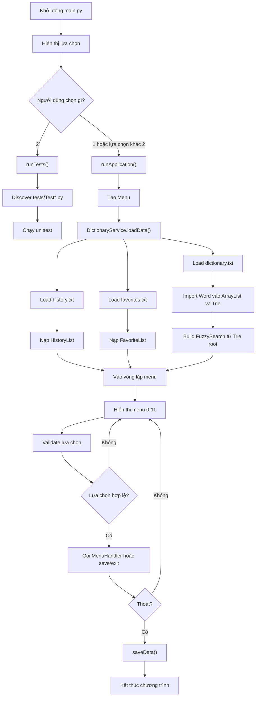
```mermaid
flowchart TD
    A["Khởi động main.py"] --> B["Hiển thị lựa chọn"]
    B --> C{"Người dùng chọn gì?"}
    C -->|"1 hoặc lựa chọn khác 2"| D["runApplication()"]
    C -->|"2"| E["runTests()"]
    E --> F["Discover tests/Test*.py"]
    F --> G["Chạy unittest"]
    D --> H["Tạo Menu"]
    H --> I["DictionaryService.loadData()"]
    I --> J["Load dictionary.txt"]
    I --> K["Load history.txt"]
    I --> L["Load favorites.txt"]
    J --> M["Import Word vào ArrayList và Trie"]
    K --> N["Nạp HistoryList"]
    L --> O["Nạp FavoriteList"]
    M --> P["Build FuzzySearch từ Trie root"]
    N --> Q["Vào vòng lặp menu"]
    O --> Q
    P --> Q
    Q --> R["Hiển thị menu 0-11"]
    R --> S["Validate lựa chọn"]
    S --> T{"Lựa chọn hợp lệ?"}
    T -->|"Không"| R
    T -->|"Có"| U["Gọi MenuHandler hoặc save/exit"]
    U --> V{"Thoát?"}
    V -->|"Không"| R
    V -->|"Có"| W["saveData()"]
    W --> X["Kết thúc chương trình"]
```

## 3. Các chức năng người dùng

### 3.1. Thêm từ mới

Người dùng nhập từ tiếng Anh, nghĩa tiếng Việt, ví dụ và danh sách từ đồng nghĩa. Hệ thống tạo `Word`, validate dữ liệu, kiểm tra trùng, sau đó thêm vào `ArrayList` và `Trie`.

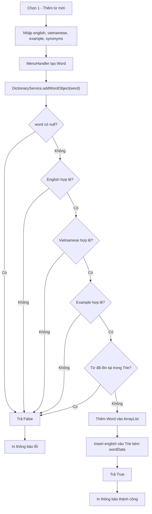
```mermaid
flowchart TD
    A["Chọn 1 - Thêm từ mới"] --> B["Nhập english, vietnamese, example, synonyms"]
    B --> C["MenuHandler tạo Word"]
    C --> D["DictionaryService.addWordObject(word)"]
    D --> E{"word có null?"}
    E -->|"Có"| Z["Trả False"]
    E -->|"Không"| F{"English hợp lệ?"}
    F -->|"Không"| Z
    F -->|"Có"| G{"Vietnamese hợp lệ?"}
    G -->|"Không"| Z
    G -->|"Có"| H{"Example hợp lệ?"}
    H -->|"Không"| Z
    H -->|"Có"| I{"Từ đã tồn tại trong Trie?"}
    I -->|"Có"| Z
    I -->|"Không"| J["Thêm Word vào ArrayList"]
    J --> K["Insert english vào Trie kèm wordData"]
    K --> L["Trả True"]
    L --> M["In thông báo thành công"]
    Z --> N["In thông báo lỗi"]
```

Logic chính:

- `StringUtils.normalizeWord()` chuẩn hóa từ tiếng Anh: bỏ khoảng trắng thừa và chuyển về chữ thường.
- `Validation.isEnglishWord()` kiểm tra từ không rỗng và không vượt độ dài cho phép.
- `Validation.isVietnameseMeaning()` kiểm tra nghĩa tiếng Việt không rỗng.
- `Validation.isValidExample()` cho phép ví dụ trống.
- `DictionaryService.wordExists()` dùng Trie để kiểm tra trùng.

### 3.2. Thêm từ đồng nghĩa

Người dùng nhập từ tiếng Anh cần cập nhật. Hệ thống tra cứu chính xác trước, nếu tìm thấy thì gọi `Word.addSynonym()`.

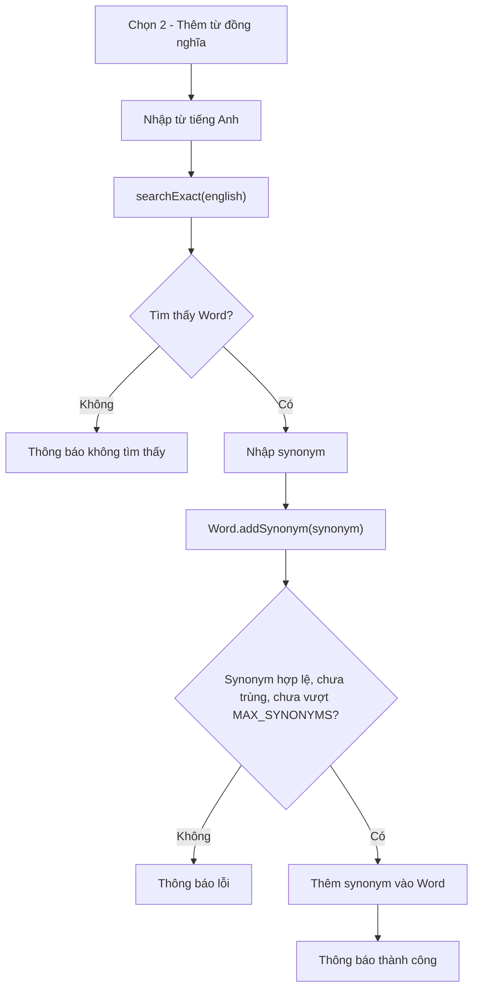
```mermaid
flowchart TD
    A["Chọn 2 - Thêm từ đồng nghĩa"] --> B["Nhập từ tiếng Anh"]
    B --> C["searchExact(english)"]
    C --> D{"Tìm thấy Word?"}
    D -->|"Không"| E["Thông báo không tìm thấy"]
    D -->|"Có"| F["Nhập synonym"]
    F --> G["Word.addSynonym(synonym)"]
    G --> H{"Synonym hợp lệ, chưa trùng, chưa vượt MAX_SYNONYMS?"}
    H -->|"Không"| I["Thông báo lỗi"]
    H -->|"Có"| J["Thêm synonym vào Word"]
    J --> K["Thông báo thành công"]
```

Logic chính:

- Synonym được chuẩn hóa giống từ tiếng Anh.
- Không thêm synonym rỗng, không hợp lệ, bị trùng hoặc vượt `AppConfig.MAX_SYNONYMS`.
- Do `Word` object đang nằm trong `ArrayList` và được Trie trỏ bằng `wordData`, cập nhật synonym trực tiếp làm thay đổi dữ liệu trong bộ nhớ.

### 3.3. Tra cứu chính xác

Tra cứu chính xác dùng Trie để kiểm tra từ có tồn tại hay không. Nếu tìm thấy, hệ thống lấy `Word` từ Trie và ghi từ đó vào lịch sử.

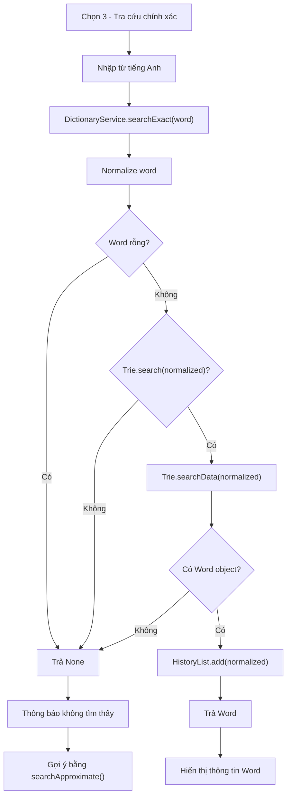
```mermaid
flowchart TD
    A["Chọn 3 - Tra cứu chính xác"] --> B["Nhập từ tiếng Anh"]
    B --> C["DictionaryService.searchExact(word)"]
    C --> D["Normalize word"]
    D --> E{"Word rỗng?"}
    E -->|"Có"| F["Trả None"]
    E -->|"Không"| G{"Trie.search(normalized)?"}
    G -->|"Không"| F
    G -->|"Có"| H["Trie.searchData(normalized)"]
    H --> I{"Có Word object?"}
    I -->|"Không"| F
    I -->|"Có"| J["HistoryList.add(normalized)"]
    J --> K["Trả Word"]
    K --> L["Hiển thị thông tin Word"]
    F --> M["Thông báo không tìm thấy"]
    M --> N["Gợi ý bằng searchApproximate()"]
```

Logic chính:

- Chỉ khi tìm thấy chính xác thì từ mới được thêm vào lịch sử.
- `HistoryList` giới hạn số phần tử theo `AppConfig.MAX_HISTORY_SIZE`.
- Khi vượt giới hạn, phần tử cũ nhất bị xóa theo cơ chế FIFO.

### 3.4. Tìm kiếm gần đúng

Tìm kiếm gần đúng dùng `FuzzySearch` kết hợp Trie và Levenshtein. Hệ thống duyệt Trie theo từng ký tự, tính từng dòng Levenshtein để loại bỏ nhánh không còn khả năng khớp.

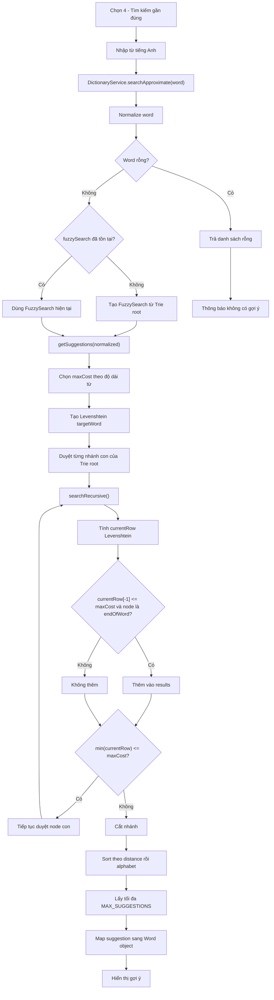
```mermaid
flowchart TD
    A["Chọn 4 - Tìm kiếm gần đúng"] --> B["Nhập từ tiếng Anh"]
    B --> C["DictionaryService.searchApproximate(word)"]
    C --> D["Normalize word"]
    D --> E{"Word rỗng?"}
    E -->|"Có"| F["Trả danh sách rỗng"]
    E -->|"Không"| G{"fuzzySearch đã tồn tại?"}
    G -->|"Không"| H["Tạo FuzzySearch từ Trie root"]
    G -->|"Có"| I["Dùng FuzzySearch hiện tại"]
    H --> J["getSuggestions(normalized)"]
    I --> J
    J --> K["Chọn maxCost theo độ dài từ"]
    K --> L["Tạo Levenshtein targetWord"]
    L --> M["Duyệt từng nhánh con của Trie root"]
    M --> N["searchRecursive()"]
    N --> O["Tính currentRow Levenshtein"]
    O --> P{"currentRow[-1] <= maxCost và node là endOfWord?"}
    P -->|"Có"| Q["Thêm vào results"]
    P -->|"Không"| R["Không thêm"]
    Q --> S{"min(currentRow) <= maxCost?"}
    R --> S
    S -->|"Có"| T["Tiếp tục duyệt node con"]
    S -->|"Không"| U["Cắt nhánh"]
    T --> N
    U --> V["Sort theo distance rồi alphabet"]
    V --> W["Lấy tối đa MAX_SUGGESTIONS"]
    W --> X["Map suggestion sang Word object"]
    X --> Y["Hiển thị gợi ý"]
    F --> Z["Thông báo không có gợi ý"]
```

Logic chính:

- Từ ngắn có ngưỡng sai khác nhỏ hơn từ dài.
- Ngưỡng hiện tại trong `AppConfig`:
  - Độ dài `<= SHORT_WORD_LENGTH`: distance tối đa `SHORT_WORD_DISTANCE`.
  - Độ dài `<= MEDIUM_WORD_LENGTH`: distance tối đa `MEDIUM_WORD_DISTANCE`.
  - Còn lại: distance tối đa `LONG_WORD_DISTANCE`.
- Kết quả được sắp xếp theo khoảng cách nhỏ nhất, sau đó theo thứ tự alphabet.
- Số gợi ý tối đa là `AppConfig.MAX_SUGGESTIONS`.

### 3.5. Hiển thị lịch sử tra cứu

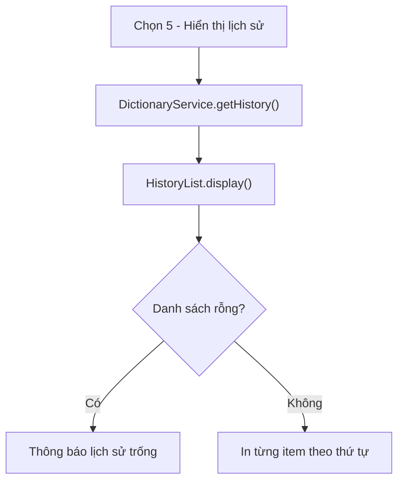
```mermaid
flowchart TD
    A["Chọn 5 - Hiển thị lịch sử"] --> B["DictionaryService.getHistory()"]
    B --> C["HistoryList.display()"]
    C --> D{"Danh sách rỗng?"}
    D -->|"Có"| E["Thông báo lịch sử trống"]
    D -->|"Không"| F["In từng item theo thứ tự"]
```

Logic chính:

- Lịch sử chỉ được ghi khi tra cứu chính xác thành công.
- Dữ liệu lịch sử được lưu trong `history.txt`.
- Khi lưu file, mỗi từ được ghi trên một dòng.

### 3.6. Thêm từ vào Favorites

Người dùng chỉ thêm được từ đã tồn tại trong từ điển.

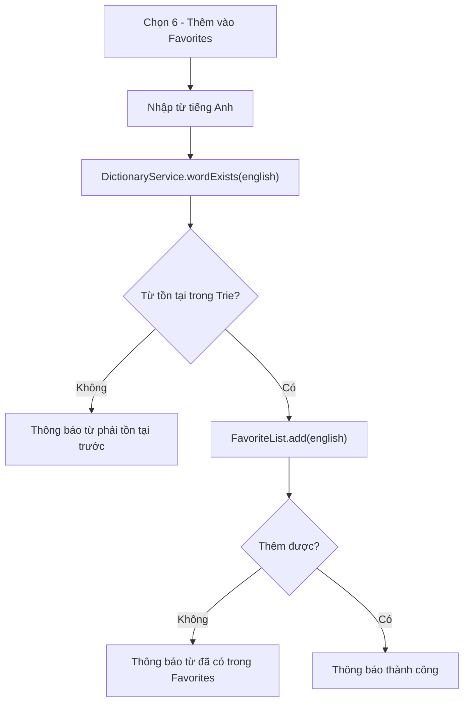
```mermaid
flowchart TD
    A["Chọn 6 - Thêm vào Favorites"] --> B["Nhập từ tiếng Anh"]
    B --> C["DictionaryService.wordExists(english)"]
    C --> D{"Từ tồn tại trong Trie?"}
    D -->|"Không"| E["Thông báo từ phải tồn tại trước"]
    D -->|"Có"| F["FavoriteList.add(english)"]
    F --> G{"Thêm được?"}
    G -->|"Không"| H["Thông báo từ đã có trong Favorites"]
    G -->|"Có"| I["Thông báo thành công"]
```

Logic chính:

- `FavoriteList.add()` chuẩn hóa từ và chống trùng.
- Điều kiện "từ phải tồn tại trong từ điển" đang nằm ở `MenuHandler.addFavorite()`.
- Dữ liệu favorites được lưu trong `favorites.txt`.

### 3.7. Xóa từ khỏi Favorites

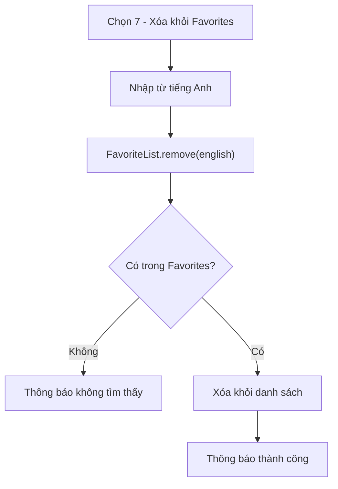
```mermaid
flowchart TD
    A["Chọn 7 - Xóa khỏi Favorites"] --> B["Nhập từ tiếng Anh"]
    B --> C["FavoriteList.remove(english)"]
    C --> D{"Có trong Favorites?"}
    D -->|"Không"| E["Thông báo không tìm thấy"]
    D -->|"Có"| F["Xóa khỏi danh sách"]
    F --> G["Thông báo thành công"]
```

### 3.8. Hiển thị Favorites

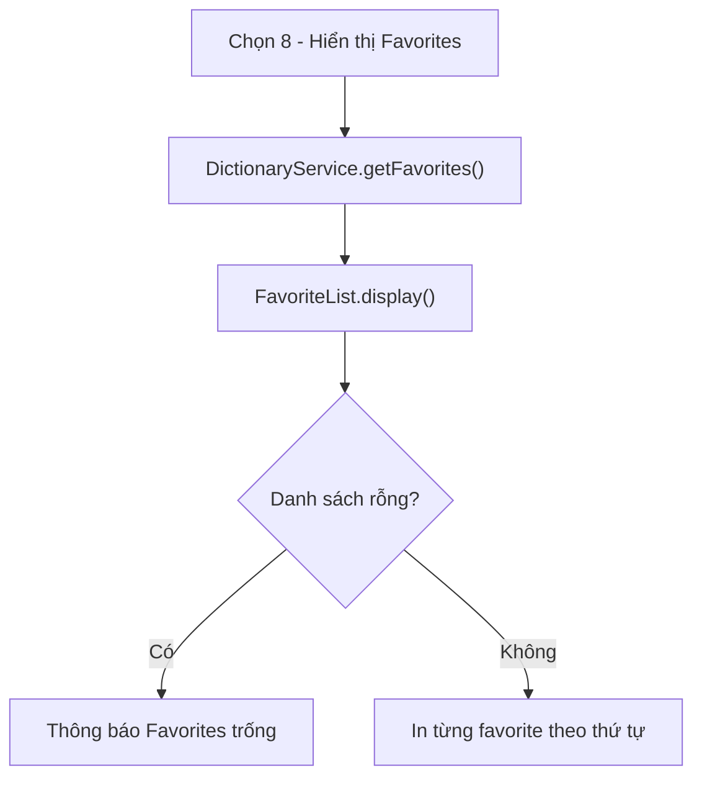
```mermaid
flowchart TD
    A["Chọn 8 - Hiển thị Favorites"] --> B["DictionaryService.getFavorites()"]
    B --> C["FavoriteList.display()"]
    C --> D{"Danh sách rỗng?"}
    D -->|"Có"| E["Thông báo Favorites trống"]
    D -->|"Không"| F["In từng favorite theo thứ tự"]
```

### 3.9. Hiển thị tất cả từ

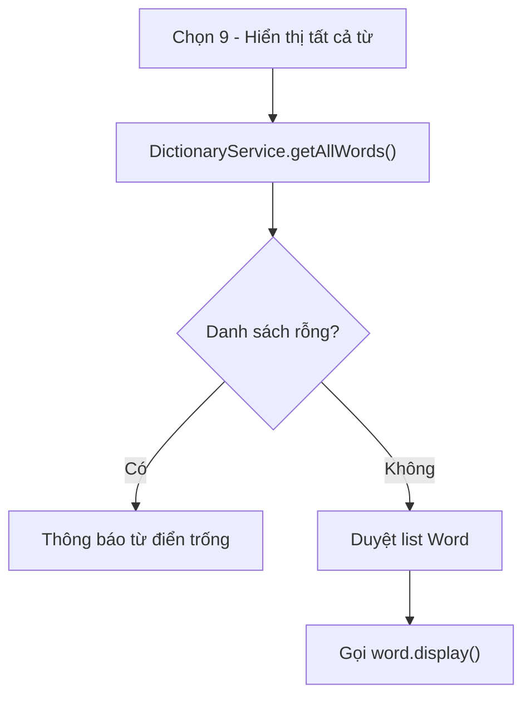
```mermaid
flowchart TD
    A["Chọn 9 - Hiển thị tất cả từ"] --> B["DictionaryService.getAllWords()"]
    B --> C{"Danh sách rỗng?"}
    C -->|"Có"| D["Thông báo từ điển trống"]
    C -->|"Không"| E["Duyệt list Word"]
    E --> F["Gọi word.display()"]
```

Logic chính:

- `getAllWords()` chuyển dữ liệu từ `ArrayList` sang list Python.
- Mỗi `Word` tự hiển thị english, vietnamese, example và synonyms nếu có.

### 3.10. Lưu dữ liệu

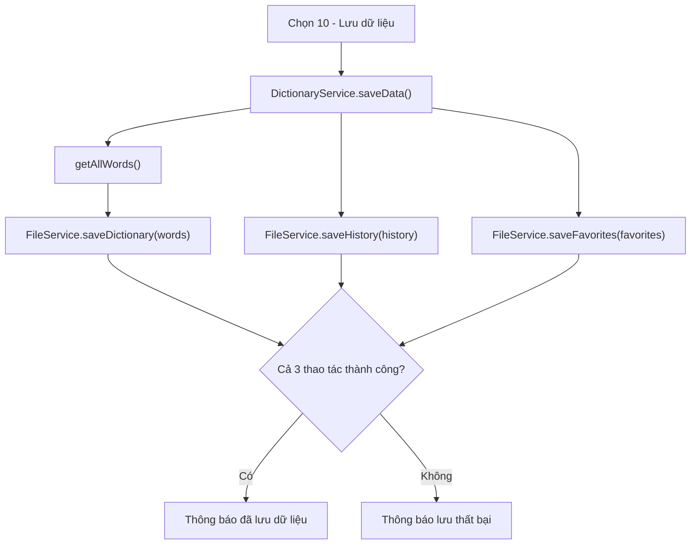
```mermaid
flowchart TD
    A["Chọn 10 - Lưu dữ liệu"] --> B["DictionaryService.saveData()"]
    B --> C["getAllWords()"]
    C --> D["FileService.saveDictionary(words)"]
    B --> E["FileService.saveHistory(history)"]
    B --> F["FileService.saveFavorites(favorites)"]
    D --> G{"Cả 3 thao tác thành công?"}
    E --> G
    F --> G
    G -->|"Có"| H["Thông báo đã lưu dữ liệu"]
    G -->|"Không"| I["Thông báo lưu thất bại"]
```

Logic chính:

- `dictionary.txt` lưu mỗi từ theo format: `english|vietnamese|example|synonym1,synonym2`.
- `history.txt` và `favorites.txt` lưu mỗi item trên một dòng.
- `FileService.ensureDataFiles()` tạo file nếu chưa tồn tại.

### 3.11. Xóa từ khỏi từ điển

Xóa từ khỏi Trie bằng `Trie.delete()`, sau đó xóa khỏi `ArrayList`, rebuild cache `FuzzySearch` và xóa khỏi Favorites nếu có.

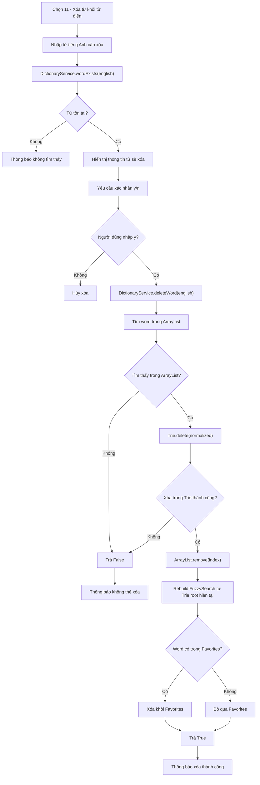
```mermaid
flowchart TD
    A["Chọn 11 - Xóa từ khỏi từ điển"] --> B["Nhập từ tiếng Anh cần xóa"]
    B --> C["DictionaryService.wordExists(english)"]
    C --> D{"Từ tồn tại?"}
    D -->|"Không"| E["Thông báo không tìm thấy"]
    D -->|"Có"| F["Hiển thị thông tin từ sẽ xóa"]
    F --> G["Yêu cầu xác nhận y/n"]
    G --> H{"Người dùng nhập y?"}
    H -->|"Không"| I["Hủy xóa"]
    H -->|"Có"| J["DictionaryService.deleteWord(english)"]
    J --> K["Tìm word trong ArrayList"]
    K --> L{"Tìm thấy trong ArrayList?"}
    L -->|"Không"| M["Trả False"]
    L -->|"Có"| N["Trie.delete(normalized)"]
    N --> O{"Xóa trong Trie thành công?"}
    O -->|"Không"| M
    O -->|"Có"| P["ArrayList.remove(index)"]
    P --> Q["Rebuild FuzzySearch từ Trie root hiện tại"]
    Q --> R{"Word có trong Favorites?"}
    R -->|"Có"| S["Xóa khỏi Favorites"]
    R -->|"Không"| T["Bỏ qua Favorites"]
    S --> U["Trả True"]
    T --> U
    U --> V["Thông báo xóa thành công"]
    M --> W["Thông báo không thể xóa"]
```

Logic chính:

- `Trie.delete()` bỏ `isEndOfWord`, xóa `wordData` và prune các node không còn dùng.
- Các node còn phục vụ từ khác có chung prefix được giữ lại.
- Từ chỉ bị xóa khỏi `ArrayList` sau khi xóa trong Trie thành công.
- `FuzzySearch` được tạo lại từ Trie root hiện tại.
- Nếu từ bị xóa đang nằm trong Favorites, hệ thống xóa luôn khỏi Favorites.

### 3.12. Thoát chương trình

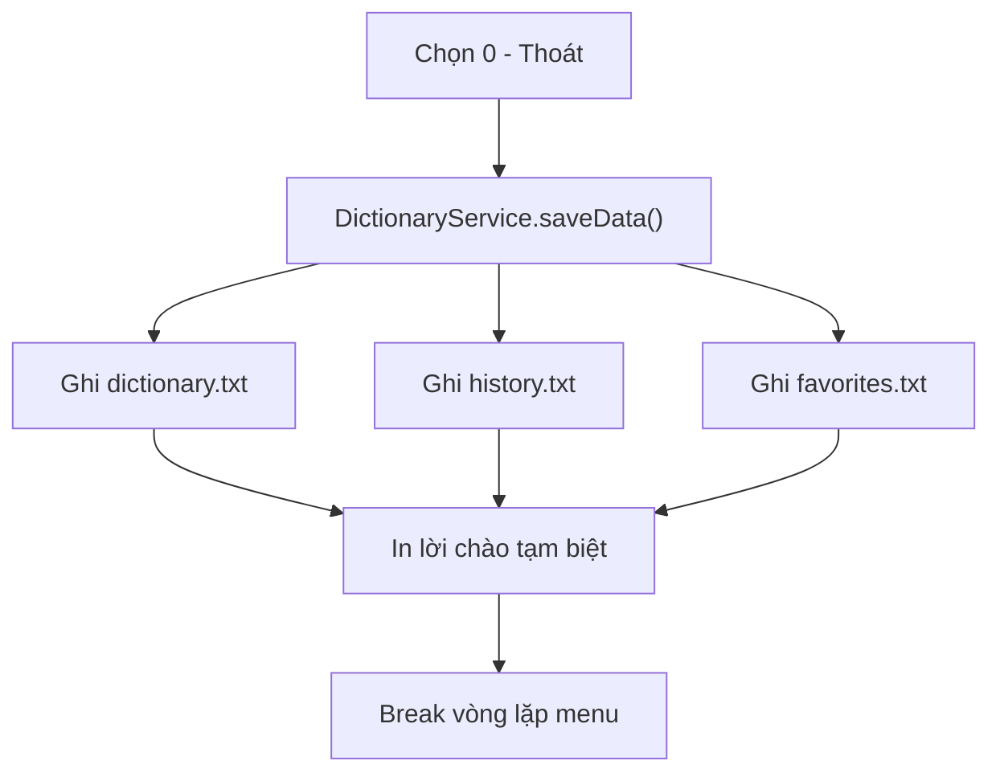
```mermaid
flowchart TD
    A["Chọn 0 - Thoát"] --> B["DictionaryService.saveData()"]
    B --> C["Ghi dictionary.txt"]
    B --> D["Ghi history.txt"]
    B --> E["Ghi favorites.txt"]
    C --> F["In lời chào tạm biệt"]
    D --> F
    E --> F
    F --> G["Break vòng lặp menu"]
```

## 4. Logic đọc dữ liệu khi khởi động

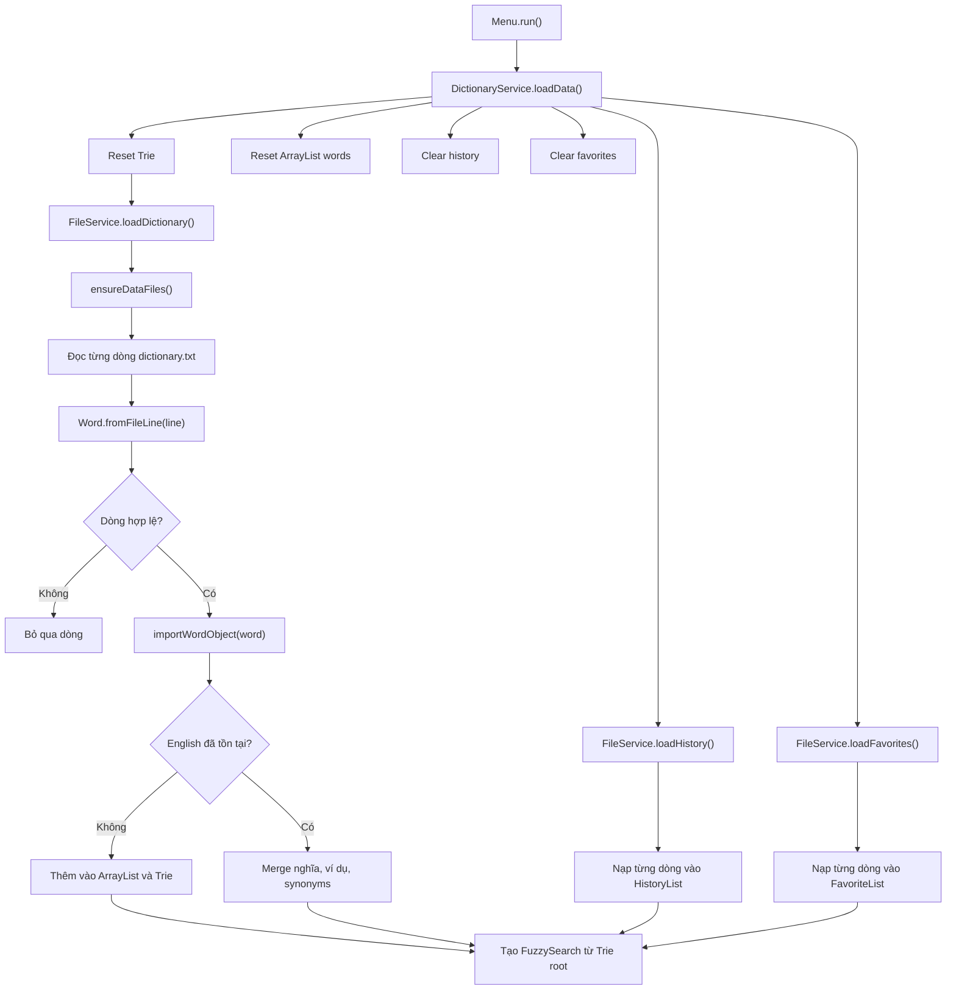
```mermaid
flowchart TD
    A["Menu.run()"] --> B["DictionaryService.loadData()"]
    B --> C["Reset Trie"]
    B --> D["Reset ArrayList words"]
    B --> E["Clear history"]
    B --> F["Clear favorites"]
    C --> G["FileService.loadDictionary()"]
    G --> H["ensureDataFiles()"]
    H --> I["Đọc từng dòng dictionary.txt"]
    I --> J["Word.fromFileLine(line)"]
    J --> K{"Dòng hợp lệ?"}
    K -->|"Không"| L["Bỏ qua dòng"]
    K -->|"Có"| M["importWordObject(word)"]
    M --> N{"English đã tồn tại?"}
    N -->|"Không"| O["Thêm vào ArrayList và Trie"]
    N -->|"Có"| P["Merge nghĩa, ví dụ, synonyms"]
    B --> Q["FileService.loadHistory()"]
    Q --> R["Nạp từng dòng vào HistoryList"]
    B --> S["FileService.loadFavorites()"]
    S --> T["Nạp từng dòng vào FavoriteList"]
    O --> U["Tạo FuzzySearch từ Trie root"]
    P --> U
    R --> U
    T --> U
```

Logic chính:

- Khi load dữ liệu, service reset toàn bộ state để tránh dữ liệu cũ bị lặp.
- Dòng từ điển sai định dạng bị bỏ qua.
- Nếu file có nhiều dòng cùng english, `importWordObject()` merge nghĩa và synonym thay vì tạo bản ghi trùng.
- Sau khi nạp xong dictionary, `FuzzySearch` được build từ Trie hiện tại.

## 5. Logic model Word

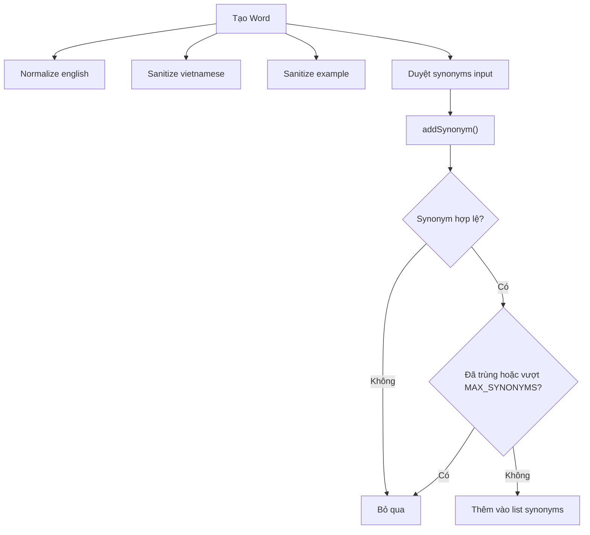
```mermaid
flowchart TD
    A["Tạo Word"] --> B["Normalize english"]
    A --> C["Sanitize vietnamese"]
    A --> D["Sanitize example"]
    A --> E["Duyệt synonyms input"]
    E --> F["addSynonym()"]
    F --> G{"Synonym hợp lệ?"}
    G -->|"Không"| H["Bỏ qua"]
    G -->|"Có"| I{"Đã trùng hoặc vượt MAX_SYNONYMS?"}
    I -->|"Có"| H
    I -->|"Không"| J["Thêm vào list synonyms"]
```

Các logic chính trong `Word`:

- `toFileLine()` chuyển object thành một dòng text để lưu file.
- `fromFileLine()` parse một dòng text thành `Word`.
- `_sanitize()` thay ký tự phân tách field `|` bằng khoảng trắng để không làm hỏng format file.
- `getMeaningList()` tách nhiều nghĩa theo `AppConfig.MEANING_SEPARATOR`.
- `addMeaning()` thêm nghĩa mới nếu hợp lệ và chưa trùng.
- `mergeFrom()` merge nghĩa, ví dụ và synonym từ object khác cùng english.

## 6. Cấu trúc dữ liệu chính

### Trie

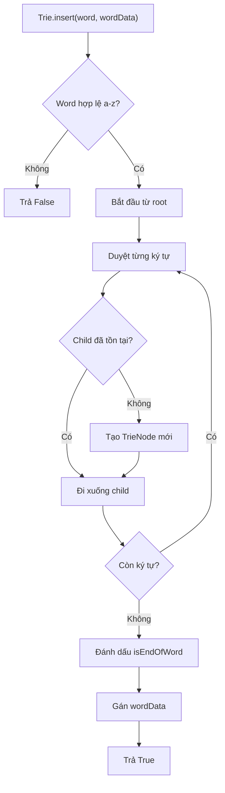
```mermaid
flowchart TD
    A["Trie.insert(word, wordData)"] --> B{"Word hợp lệ a-z?"}
    B -->|"Không"| C["Trả False"]
    B -->|"Có"| D["Bắt đầu từ root"]
    D --> E["Duyệt từng ký tự"]
    E --> F{"Child đã tồn tại?"}
    F -->|"Không"| G["Tạo TrieNode mới"]
    F -->|"Có"| H["Đi xuống child"]
    G --> H
    H --> I{"Còn ký tự?"}
    I -->|"Có"| E
    I -->|"Không"| J["Đánh dấu isEndOfWord"]
    J --> K["Gán wordData"]
    K --> L["Trả True"]
```

Trie hỗ trợ:

- `insert()`: thêm từ và gắn `Word` object vào node cuối.
- `search()`: kiểm tra từ tồn tại.
- `searchData()`: lấy `Word` object tại node cuối.
- `delete()`: xóa từ khỏi Trie, xóa `wordData` và prune node dư thừa mà không ảnh hưởng từ chung prefix.
- `startsWith()`: kiểm tra prefix.

### ArrayList

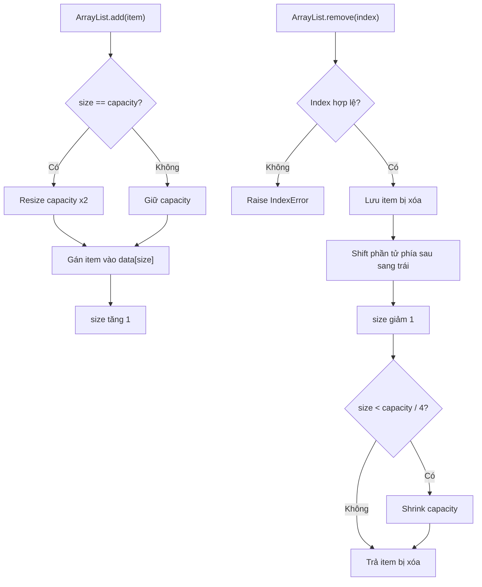
```mermaid
flowchart TD
    A["ArrayList.add(item)"] --> B{"size == capacity?"}
    B -->|"Có"| C["Resize capacity x2"]
    B -->|"Không"| D["Giữ capacity"]
    C --> E["Gán item vào data[size]"]
    D --> E
    E --> F["size tăng 1"]

    G["ArrayList.remove(index)"] --> H{"Index hợp lệ?"}
    H -->|"Không"| I["Raise IndexError"]
    H -->|"Có"| J["Lưu item bị xóa"]
    J --> K["Shift phần tử phía sau sang trái"]
    K --> L["size giảm 1"]
    L --> M{"size < capacity / 4?"}
    M -->|"Có"| N["Shrink capacity"]
    M -->|"Không"| O["Trả item bị xóa"]
    N --> O
```

## 7. Validation và chuẩn hóa dữ liệu

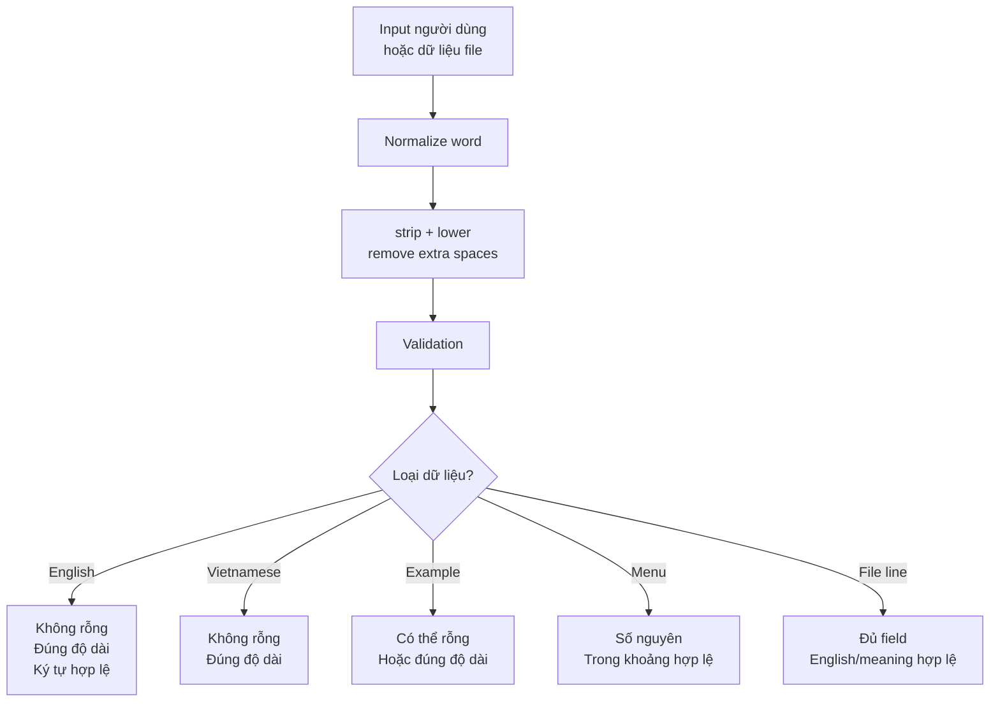
```mermaid
flowchart TD
    A["Input người dùng<br/>hoặc dữ liệu file"] --> B["Normalize word"]
    B --> C["strip + lower<br/>remove extra spaces"]
    C --> D["Validation"]
    D --> E{"Loại dữ liệu?"}
    E -->|"English"| F["Không rỗng<br/>Đúng độ dài<br/>Ký tự hợp lệ"]
    E -->|"Vietnamese"| G["Không rỗng<br/>Đúng độ dài"]
    E -->|"Example"| H["Có thể rỗng<br/>Hoặc đúng độ dài"]
    E -->|"Menu"| I["Số nguyên<br/>Trong khoảng hợp lệ"]
    E -->|"File line"| J["Đủ field<br/>English/meaning hợp lệ"]
```

Chi tiết các nhánh validation:

| Nhánh | Điều kiện |
| --- | --- |
| English | Không rỗng, đúng độ dài, gồm chữ cái/dấu cách/dấu gạch ngang |
| Vietnamese | Không rỗng và đúng độ dài |
| Example | Được phép rỗng; nếu có nội dung thì phải đúng độ dài |
| Menu | Là số nguyên từ `MIN_MENU_OPTION` đến `MAX_MENU_OPTION` |
| File line | Đủ số field và có english/meaning hợp lệ |

Các giới hạn chính:

| Cấu hình | Ý nghĩa |
| --- | --- |
| `MAX_SYNONYMS` | Số từ đồng nghĩa tối đa của một `Word` |
| `MAX_HISTORY_SIZE` | Số lịch sử tra cứu tối đa |
| `MAX_SUGGESTIONS` | Số gợi ý tìm kiếm gần đúng tối đa |
| `MIN_WORD_LENGTH`, `MAX_WORD_LENGTH` | Độ dài từ tiếng Anh |
| `MIN_MEANING_LENGTH`, `MAX_MEANING_LENGTH` | Độ dài nghĩa tiếng Việt |
| `MIN_EXAMPLE_LENGTH`, `MAX_EXAMPLE_LENGTH` | Độ dài ví dụ |
| `MIN_MENU_OPTION`, `MAX_MENU_OPTION` | Khoảng lựa chọn menu hợp lệ |

## 8. Quan hệ dữ liệu khi lưu trữ

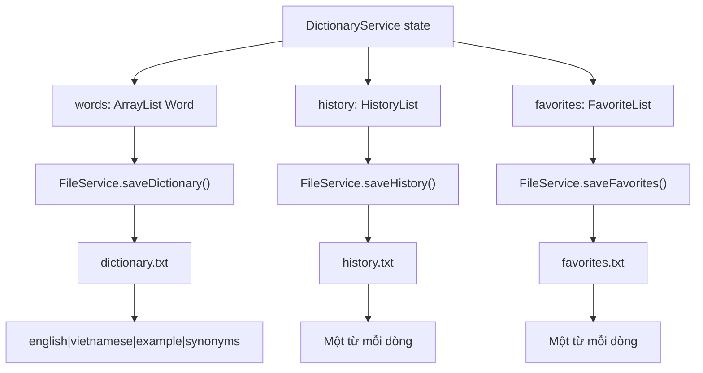
```mermaid
flowchart TD
    A["DictionaryService state"] --> B["words: ArrayList Word"]
    A --> C["history: HistoryList"]
    A --> D["favorites: FavoriteList"]
    B --> E["FileService.saveDictionary()"]
    C --> F["FileService.saveHistory()"]
    D --> G["FileService.saveFavorites()"]
    E --> H["dictionary.txt"]
    F --> I["history.txt"]
    G --> J["favorites.txt"]
    H --> K["english|vietnamese|example|synonyms"]
    I --> L["Một từ mỗi dòng"]
    J --> M["Một từ mỗi dòng"]
```

## 9. Tóm tắt logic nghiệp vụ chính

| Nghiệp vụ | Logic cốt lõi |
| --- | --- |
| Load dữ liệu | Reset state, đọc file, parse `Word`, nạp vào `ArrayList`, insert Trie, load history/favorites |
| Thêm từ | Validate, chống trùng bằng Trie, thêm vào `ArrayList` và Trie |
| Import từ | Validate, nếu trùng english thì merge dữ liệu |
| Tra cứu chính xác | Normalize, tìm trong Trie, lấy `wordData`, ghi history |
| Tìm gần đúng | Duyệt Trie với Levenshtein row, cắt nhánh theo max distance, sort kết quả |
| Thêm synonym | Tìm `Word`, validate synonym, chống trùng, giới hạn số lượng |
| Favorites | Chỉ thêm từ đã tồn tại, chống trùng, hỗ trợ xóa và hiển thị |
| History | Ghi khi tra cứu chính xác thành công, giới hạn số lượng, xóa bản ghi cũ nhất khi đầy |
| Xóa từ | Xóa bằng `Trie.delete()`, xóa khỏi `ArrayList`, rebuild fuzzy search, xóa khỏi Favorites nếu có |
| Lưu dữ liệu | Ghi dictionary/history/favorites ra file text |

## 10. Ghi chú kỹ thuật

- Runtime chính đang dùng `structures.Word.Word` trong `DictionaryService`, `FileService` và `MenuHandler`.
- Trie chỉ nhận ký tự `a-z`, trong khi validation tiếng Anh hiện cho phép thêm khoảng trắng và dấu gạch ngang. Nếu nhập từ có ký tự Trie không nhận, cần cân nhắc đồng bộ rule validation với rule của Trie.
- `FuzzySearch` được tạo lại khi load dữ liệu và sau khi xóa từ bằng `Trie.delete()`. Khi thêm từ mới, từ đó đã được insert vào Trie nhưng cache `FuzzySearch` cũ có thể chưa được rebuild ngay nếu đã từng khởi tạo trước đó.
